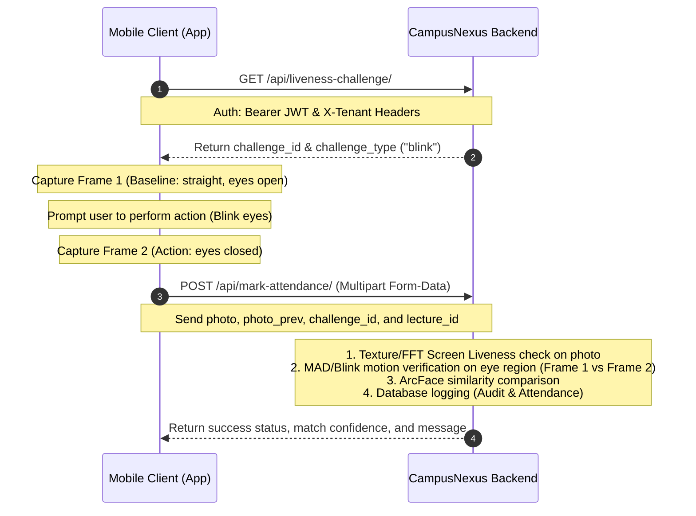

# CampusNexus Mobile Biometrics Integration Guide

This guide details the integration of the face recognition and liveness pipeline from a mobile client (such as Flutter or React Native) to the CampusNexus Django REST Backend.

---

## 1. General Request Requirements

All requests to the biometrics APIs must include the following headers for authorization and multi-tenant database routing:

```http
Authorization: Bearer <jwt_access_token>
X-Tenant: <tenant_schema_name>
```

> [!IMPORTANT]
> The `X-Tenant` header resolves which college's database schema is targeted. You can extract the `tenant_schema` from the JWT payload or standard login response claims.

---

## 2. API Endpoints

### A. Fetch Liveness Challenge
* **Endpoint:** `GET /api/liveness-challenge/` (or `GET /api/liveness-challenge`)
* **Headers:** `Authorization`, `X-Tenant`
* **Response Payload (JSON):**
  ```json
  {
    "challenge_id": "challenge_token_string",
    "challenge_type": "blink"
  }
  ```
  * *Possible values for `challenge_type`:* `blink`, `nod`, `turn_left`, `turn_right`.

---

### B. Register Face (Enrollment)
Register three selfies taken at different angles. Requires active biometric consent under the DPDP Act 2023.
* **Endpoint:** `POST /api/register-face/` (or `POST /api/register-face`)
* **Headers:** `Authorization`, `X-Tenant`, `Content-Type: multipart/form-data`
* **Form-Data Fields:**
  * `biometric_consent_given`: `true` (Boolean/String)
  * `front`: Image file (JPEG/PNG)
  * `left`: Image file (JPEG/PNG)
  * `right`: Image file (JPEG/PNG)
* **Response Payload (JSON):**
  ```json
  {
    "message": "Face registration successful. All 3 angles stored and biometric consent logged.",
    "angles": {
      "front": "✓ Embedding stored",
      "left": "✓ Embedding stored",
      "right": "✓ Embedding stored"
    }
  }
  ```

---

### C. Verify & Mark Attendance
Accepts a baseline frame, a challenge action frame, and the token verification details.
* **Endpoint:** `POST /api/mark-attendance/` (or `POST /api/mark-attendance`)
* **Headers:** `Authorization`, `X-Tenant`, `Content-Type: multipart/form-data`
* **Form-Data Fields:**
  * `lecture_id`: (Integer) ID of the active lecture session.
  * `challenge_id`: (String) The exact `challenge_id` obtained in Step A.
  * `photo`: Image file (The final capture containing the performed challenge action, e.g. eyes closed for `blink`, or turned head).
  * `photo_prev`: Image file (The baseline frame captured ~1 second before the action, looking straight at the camera with eyes open).
  * `device_id`: (String, Optional) Hardware identifier of the device for binding validation.
* **Response Payload (JSON):**
  ```json
  {
    "success": true,
    "is_verified": true,
    "confidence_score": 0.824,
    "liveness_passed": true,
    "message": "Attendance verified successfully (confidence: 82.40%)."
  }
  ```

---

## 3. Client-Side Implementation Examples

````carousel
```dart
// Flutter (Dart / Dio) Example
import 'dart:io';
import 'package:dio/dio.dart';

class BiometricService {
  final Dio _dio = Dio(BaseOptions(baseUrl: "https://api.campusnexus.in"));

  // 1. Fetch Challenge
  Future<Map<String, dynamic>> fetchChallenge(String token, String tenant) async {
    final response = await _dio.get(
      "/api/liveness-challenge/",
      options: Options(headers: {
        "Authorization": "Bearer $token",
        "X-Tenant": tenant,
      }),
    );
    return response.data;
  }

  // 2. Mark Attendance
  Future<Response> markAttendance({
    required String token,
    required String tenant,
    required int lectureId,
    required String challengeId,
    required File photoFile,
    required File photoPrevFile,
    required String deviceId,
  }) async {
    FormData formData = FormData.fromMap({
      "lecture_id": lectureId,
      "challenge_id": challengeId,
      "device_id": deviceId,
      "photo": await MultipartFile.fromFile(photoFile.path, filename: "selfie.jpg"),
      "photo_prev": await MultipartFile.fromFile(photoPrevFile.path, filename: "baseline.jpg"),
    });

    return await _dio.post(
      "/api/mark-attendance/",
      data: formData,
      options: Options(headers: {
        "Authorization": "Bearer $token",
        "X-Tenant": tenant,
        "Content-Type": "multipart/form-data",
      }),
    );
  }
}
```
<!-- slide -->
```javascript
// React Native (JavaScript / Axios) Example
import axios from 'axios';

const api = axios.create({ baseURL: 'https://api.campusnexus.in' });

// 1. Fetch Challenge
async function fetchChallenge(token, tenant) {
  const res = await api.get('/api/liveness-challenge/', {
    headers: {
      'Authorization': `Bearer ${token}`,
      'X-Tenant': tenant,
    }
  });
  return res.data;
}

// 2. Mark Attendance
async function markAttendance(token, tenant, { lectureId, challengeId, photoUri, photoPrevUri, deviceId }) {
  const formData = new FormData();
  formData.append('lecture_id', lectureId);
  formData.append('challenge_id', challengeId);
  formData.append('device_id', deviceId);
  
  formData.append('photo', {
    uri: photoUri,
    name: 'selfie.jpg',
    type: 'image/jpeg',
  });
  
  formData.append('photo_prev', {
    uri: photoPrevUri,
    name: 'baseline.jpg',
    type: 'image/jpeg',
  });

  const res = await api.post('/api/mark-attendance/', formData, {
    headers: {
      'Authorization': `Bearer ${token}`,
      'X-Tenant': tenant,
      'Content-Type': 'multipart/form-data',
    }
  });
  return res.data;
}
```
````

---

## 4. Interaction Flow Diagram


