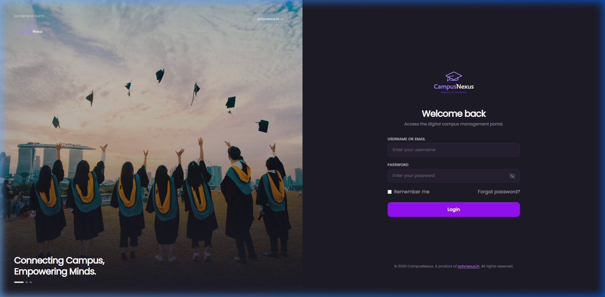
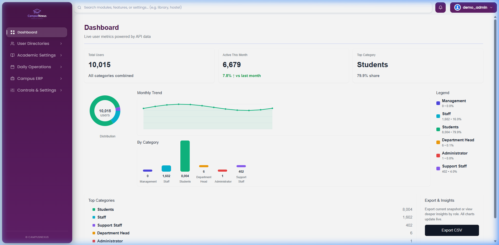
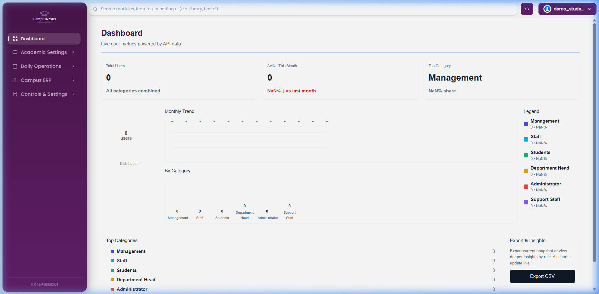

# CampusNexus User Login & Dashboard Manual

This manual provides instructions for logging into the CampusNexus application and explains the dashboards corresponding to different seeded roles.

---

## Environment Setup

The application is running in a local multi-tenant configuration on your virtual machine/local environment with the following endpoints:
- **Backend (API)**: `http://localhost:8000/` (or `http://127.0.0.1:8000/`)
- **Frontend**: `http://localhost:5173/` (or resolved via tenant domain `http://demo.localhost:5173/`)

---

## Seeded User Credentials

All test users are seeded inside the `demo` tenant schema context. The default password for all seeded users is **`Password123`**.

| Role | Username | Email | Default Password | Schema |
| :--- | :--- | :--- | :--- | :--- |
| **Administrator** | `demo_admin` | `admin@demo.edu` | `Password123` | `demo` |
| **Management** | `demo_mgmt` | `mgmt@demo.localhost` | `Password123` | `demo` |
| **Department Head (HOD)** | `demo_hod` | `hod@demo.localhost` | `Password123` | `demo` |
| **Faculty** | `demo_faculty` | `faculty@demo.localhost` | `Password123` | `demo` |
| **Support Staff (Librarian)** | `demo_support` | `support@demo.localhost` | `Password123` | `demo` |
| **Student** | `demo_student` | `student@demo.localhost` | `Password123` | `demo` |

---

## Login Flow

1. Open your web browser and navigate to **`http://demo.localhost:5173/login`** (or `http://localhost:5173/login`).
2. Input the user's role-specific **Username** (e.g., `demo_admin`).
3. Enter the default password **`Password123`** in the password field.
4. Click the purple **Login** button.

### Login Screen
The login screen is built with a dual-pane premium dark theme, containing the CampusNexus branding and links.



---

## Dashboards Showcase

### 1. Administrator Dashboard (`demo_admin`)
The system administrator view provides access to global tenant analytics and metrics across the institution.
* **Key Features**:
  * View total user distribution (10,015 users) and active users this month (6,679).
  * Monthly registration trends and graphical breakdown by role category.
  * Sidebars to navigate user directories, academic settings, and audit logs.
  * **Export CSV** feature for reporting.



---

### 2. Faculty Dashboard (`demo_faculty`)
The teaching staff profile provides a filtered view focused on student directories, schedules, and attendance.
* **Key Features**:
  * Shows student-specific metrics (8,004 students).
  * Attendance tracking trends and analytics.
  * Filtered access to relevant departments.


---

### 3. Student Dashboard (`demo_student`)
The student view is secure and isolates student analytics. It restricts access to administrative tables, showing clean indicators tailored for personal schedules, marks, and fees.



---

## Troubleshooting & Resolutions

### 1. CORS Errors (Solved)
* **Problem**: The frontend failed to connect or login, displaying "Login failed" or network connection issues in the browser console.
* **Resolution**: The backend middleware CORS configuration was updated to allow requests originating from `http://localhost:5173` and `http://demo.localhost:5173`. Additionally, the custom `x-tenant` header was explicitly whitelisted in `settings.py` `CORS_ALLOW_HEADERS`.

### 2. UnboundLocalError in Backend Serializers (Solved)
* **Problem**: Making a POST request to `/login/` returned a `500 Internal Server Error` with `UnboundLocalError: cannot access local variable 'connection' where it is not associated with a value` in `campusflow_app/serializers.py` line 114.
* **Cause**: A local import of `connection` on line 165 was shadow-binding the variable name inside the `validate` function, making references to `connection` before line 165 throw a scope error.
* **Resolution**: Removed the redundant local import of `connection` on line 165 since it is already imported globally at the top of the file on line 7:
  ```python
  from django.db import connection, transaction
  ```
